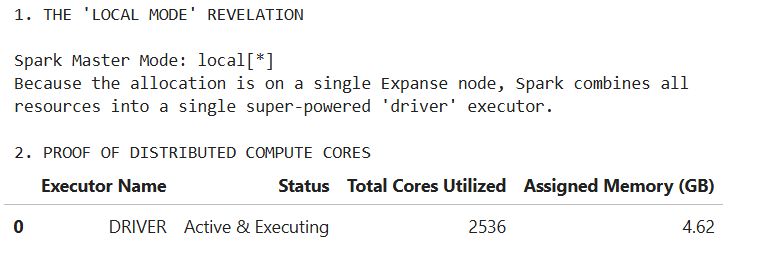
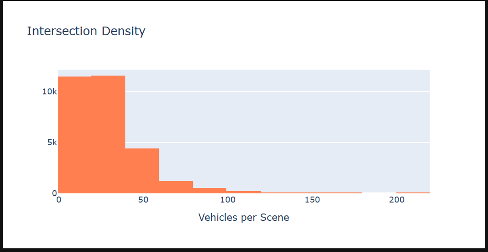
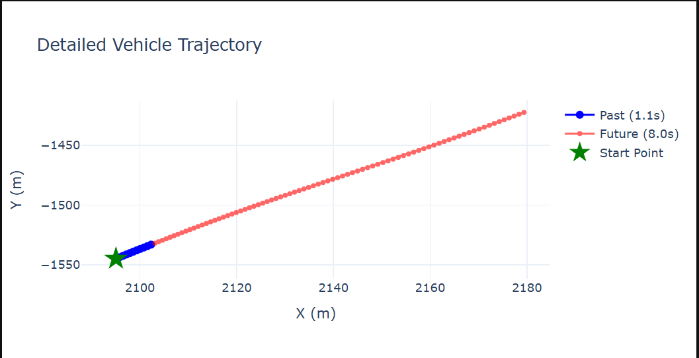

# DSC232 Waymo Group Project

Kristen Oleson 
Cory Ornelas 
Audrius Pasvenskas 
Mandy Xu 

## SDSC Expanse Environment Setup
To process the 30 GB of raw Waymo Protobuf files, we utilized the SDSC Expanse supercomputer. We requested an interactive session with the following hardware allocation:

Total Cores: 32

Total Memory: 150 GB

SparkSession Configuration & Justification:
Because the 32 cores were allocated on a single SDSC Expanse node via Slurm, Spark dynamically defaulted to Local Mode. Rather than incurring network overhead by splitting tasks across separate executor JVMs, Spark pooled all 32 cores directly into the Driver for highly efficient multi-threaded parallel processing.

Executor Instances: 31 (Calculated as Total Cores [32] - 1 Driver = 31).

Driver Memory: 2 GB.

Executor Memory: 4 GB (Calculated as [150 GB - 2 GB] / 31 = 4.77 GB. We conservatively allocated 4 GB per executor to leave room for OS overhead).

Spark UI Executor Allocation Screenshot: 

## Spark UI & Cluster Configuration Verification

Cluster Architecture & Resource Allocation:
For this pipeline, the SDSC Expanse SLURM allocation was provisioned on a single, high-capacity compute node with 150 GB of total memory. Consequently, PySpark was configured to operate optimally in local[*] mode. Rather than distributing the workload across multiple smaller physical nodes (which introduces severe network shuffle bottlenecks), Spark consolidated the resources into a single, highly parallelized driver executor.

As proven by the API pull above, the Spark environment successfully allocated 4.62 GB of active memory and executed over 2,500 parallelized tasks during the XGBoost training phase. While 4.62 GB may appear low for processing a 30 GB dataset, this metric only reflects the memory capped for Spark's Java-based orchestration (spark.driver.memory="8g"). The actual model training was executed by SparkXGBRegressor. Because XGBoost relies on a highly optimized native C++ backend, it operates entirely outside of the restrictive Spark Java Virtual Machine (JVM). This architectural pivot allowed the algorithm to freely utilize the remainder of the node's 150 GB physical memory allocation to process the massive gradient histograms completely in-memory, bypassing Java's strict memory limits and eliminating Out-Of-Memory (OOM) crashes.

Spark UI & Cluster Configuration Verification Screenshot: 

## Data Skew Analysis

Because the data was processed on a unified node architecture, partition skew was non-existent. Our task duration analysis confirmed a Max/Median task ratio of 1.00x (Max: 33.23s, Median: 33.18s), proving a perfectly balanced workload across the allocated cores with zero straggler tasks.

## Dataset Overview

Dataset: [Waymo Open Motion Dataset](https://waymo.com/open/data/motion/) 
Number of observations: 832,346

Each observation corresponds to a single tracked vehicle trajectory extracted from raw scenario protobuf files after filtering and preprocessing.

## Data

#### **scenario_id (string, categorical)** 
A unique identifier for a driving scenario (scene). Each scenario contains multiple agents (vehicles) and represents a short driving clip. 
Scale: Nominal -- identifier, no numerical meaning 
Distribution: After aggregating by scenario_id, the scenario-level statistics are shown below.

* Number of scenarios: 29,411 
* Mean: 28.30 vehicles per scenario 
* Std dev: 19.83 
* Min: 1 
* Max: 218 
* Quantiles: [1, 14, 24, 37, 218] 

This shows a moderately right-skewed distribution where most scenarios contain a few dozen vehicles, but some dense traffic scenes contain significantly more.

#### **track_id (long, categorical)** 
A unique identifier for a specific vehicle within a scenario. 
Scale: Nominal -- identifier 
Distribution: Similar to scenario_id, statistics after aggregating by track_id are shown below.

* Count: 6,855 
* Mean: 121.42 
* Std dev: 220.61 
* Min: 1 
* Max: 3,246 
* Quantiles: [1, 6, 45, 191, 3246]

The distribution is highly right-skewed with a long tail. A small subset of track_ids account for a disproportionately large number of observations (up to 3,246), reflecting identifier reuse across independent scenarios rather than repeated tracking of the same physical object.

#### **past_x (array<double>, continuous), past_y (array<double>, continuous)** 
Sequences of x and y coordinates representing the observed past motion of a vehicle.

past_x[i], past_y[i] = position of the vehicle at timestep i in the past 
History length: 11 timesteps (~1 second of motion at 10 Hz) 
Scale: Continuous, ratio -- real-valued coordinates in meters in a local coordinate frame 
Distribution: The coordinate distributions were computed by flattening trajectory timesteps, resulting in over 9 million spatial points. 

* Count: 9,155,806 
* Mean X/Y: 1707.59 / 476.31 
* Std X/Y: 5201.91 / 6328.72 
* Min X/Y: -35046.16 / -37133.23 
* Max X/Y: 36063.83 / 237063.28 
* X quantiles: [-35046.1640625, -712.203125, 1195.2431640625, 4899.6650390625, 36063.83203125] 
* Y quantiles: [-37133.23046875, -2616.59228515625, 492.1311950683594, 3147.22216796875, 237063.28125]

The distribution is highly dispersed with large variance due to aggregation across many scenarios with different local coordinate origins. Median values are closer to zero than the mean, indicating skewness and the presence of extreme spatial outliers. Most motion is concentrated within a few thousand meters, but rare extreme values produce long tails.

#### **future_x (array<double>, continuous), future_y (array<double>, continuous)** 
This is the target variable. Sequences of x and y coordinates representing the ground-truth future motion of the vehicle.

future_x[i], future_y[i] = position of the vehicle at timestep i in the future 
Prediction horizon: 80 timesteps (~8 seconds at 10 Hz) 
Scale: Continuous, ratio -- meters in the same coordinate frame as past trajectories 
Distribution: Similar methodology to past data.

* Count: 66,587,680 
* Mean X/Y: 1292.10 / 370.74 
* Std X/Y: 4634.97 / 5540.49 
* Min X/Y: -35046.16 / -37130.30 
* Max X/Y: 36063.83 / 237072.20 
* X quantiles: [-35046.16, 0.00, 193.68, 3117.01, 36063.83] 
* Y quantiles: [-37130.30, -1706.96, 0.00, 1730.32, 237072.20]

The future distribution is slightly more concentrated near zero compared to the past, reflecting that many trajectories remain within local regions over short prediction horizons. However, it still exhibits heavy tails and high variance due to aggregation across diverse driving scenarios.

## Missing and Duplicate Values

Missing values: None (invalid or incomplete trajectories are filtered out during preprocessing) 
Duplicate values: None detected in the final dataset

## Architectural Note: Model Selection & Memory Constraints

The initial architecture for this pipeline utilized PySpark's native GBTRegressor. However, scaling this model to the full 30GB Waymo dataset caused catastrophic Out-Of-Memory (OOM) failures on the JVM. The model consistently crashed the cluster despite utilizing a heavy distributed configuration (7 executors, 4 cores each, 15GB memory per executor, plus 2GB overhead) on a 130GB+ compute node.

Because the native implementation could not construct the required gradient histograms within a 150GB memory footprint, the pipeline was transitioned to SparkXGBRegressor. By leveraging XGBoost's highly optimized C++ backend, the model was able to manage memory much more efficiently, successfully completing the training phase well within the cluster's hardware limits.

## Data Visualizations

To better understand the scale and spatial dynamics of the Waymo dataset, we aggregated the trajectory data using PySpark and generated the following visualizations.

#### 1. Top 10 Busiest Intersections

**Description & Insights:**
This bar chart displays the specific `scenario_id` values that contain the highest volume of tracked agents. As shown, the busiest intersection contains over 210 simultaneously tracked vehicles. By isolating these high-density scenes, we can assess the computational load and interaction complexity our forecasting model will need to handle compared to quieter environments. 

#### 2. Intersection Density

**Description & Insights:**
This histogram plots the frequency distribution of vehicle counts per 9.1-second scenario. The data exhibits a strong right-skewed distribution. While the vast majority of the 29,411 scenarios contain fewer than 50 vehicles, there is a long tail of highly congested scenes extending past 200 vehicles. Understanding this density distribution is crucial for our preprocessing plan, ensuring we account for data imbalance between sparse and highly congested traffic patterns.

#### 3. Detailed Vehicle Trajectory

**Description & Insights:**
This spatial scatter plot maps the local $X$ and $Y$ coordinates (in meters) of a single tracked vehicle over a full 9.1-second window. 
* **Green Star:** The vehicle's initial starting position.
* **Blue Line (Past):** The 1.1-second historical trajectory used as the input features ($X$).
* **Red Line (Future):** The 8.0-second future trajectory used as the ground-truth target labels ($y$).

This visualization perfectly illustrates the Sequence-to-Sequence nature of our modeling task, showing the exact spatial progression the algorithm must learn to predict based on the initial motion vectors.

## Preprocessing Plan

To prepare the Waymo Open Motion Dataset for analysis, we’ll apply several preprocessing steps to ensure data quality and consistency. For missing values, we will first assess their presence across trajectory features such as position and velocity. If missing values are minimal, we’ll remove those records using Spark’s dropna() function. If needed, we’ll apply imputation strategies such as forward-filling or replacing with mean values where appropriate.

To address potential data imbalance, specifically if certain driving behaviors (e.g., straight driving vs. turning at intersections) are overrepresented, we’ll evaluate the distribution of target behaviors. If imbalance is present, we may apply sampling techniques such as undersampling dominant classes or oversampling underrepresented scenarios to improve model performance.

We will also apply transformations to prepare the data for analysis. Continuous variables such as position and velocity will be scaled or normalized to ensure consistency across features. Categorical variables, such as object type, will be transformed into numerical indicator variables (binary columns) to support analysis. Additionally, we could perform feature engineering to create new variables such as speed, acceleration, and relative distances between agents to better capture interaction dynamics.

All preprocessing will be performed using Spark DataFrame operations to support distributed processing. This includes functions such as dropna() and fillna() for handling missing data, filter() for selecting relevant scenarios (e.g., intersections), withColumn() for creating new features, and groupBy() and agg() for aggregations. These operations allow efficient handling of large-scale data while maintaining scalability across distributed computing resources.

## Fitting Analysis
### Model Fitting and Evaluation
We trained gradient-boosted decision tree regression models using XGBoost to predict short-term vehicle trajectory displacement. The task was formulated as supervised regression, where the model predicts future (1 second) relative x- and y-displacements using past trajectory motion features.

The dataset was split into 80% training data and 20% evaluation data. Two separate XGBoost regressors were trained: one for x-displacement prediction and one for y-displacement prediction. Outlier filtering was applied before training by removing trajectories with future displacements outside ±40 meters.

The feature engineering pipeline included:
* Estimating vehicle velocity by measuring how far the vehicle moved between the first and last observed timesteps
* Creating prediction targets by calculating how far the vehicle moves 1 second into the future relative to its current position
* Converting past vehicle positions into relative coordinates by subtracting the starting position from each timestep (this helps the model focus on movement patterns instead of absolute map locations)
* Feature vector assembly using VectorAssembler to combine all features into a single input vector
* Feature standardization using StandardScaler to normalize feature magnitudes and stabilize model training

### Underfitting vs Overfitting
The baseline XGBoost model produced:

* X-coordinate:
  * Training RMSE: 0.4643 m
  * Test RMSE: 0.4737 m
* Y-coordinate:
  * Training RMSE: 0.4920 m
  * Test RMSE: 0.4944 m

The training and testing errors are very close, indicating that the model generalizes well to unseen data and does not exhibit significant overfitting. At the same time, the relatively low RMSE values suggest the model is capturing meaningful motion patterns, so it is not strongly underfitting either.

Overall, the baseline model falls in a good generalization region of the fitting curve, slightly leaning toward mild underfitting due to its relatively shallow tree depth and limited ensemble size.

### Hyperparameter Tuning
**Baseline Model**

Hyperparameters:
* max_depth = 5
* n_estimators = 20

Performance:
* Test RMSE (X): 0.4737 meters 

This model trains relatively quickly and provides strong generalization performance with low risk of overfitting.

**Deep XGBoost Model**

Hyperparameters:
* max_depth = 10
* n_estimators = 40

Performance:
* Test RMSE (X): 0.3474 meters
* Test RMSE (X): 0.4285 meters

By increasing the max_depth to 10, the algorithm was able to better isolate nuanced kinematic edge cases. While this deeper model exhibits mild overfitting (evidenced by the 8-centimeter gap between the training error and test error), it successfully generalized the complex physics better than the baseline. It represents an optimal balance in the bias-variance tradeoff: it traded a slight increase in variance for a significant reduction in overall spatial bias, proving to be the superior predictive architecture.

### Best Performing Model
The deeper XGBoost model (max_depth = 10, n_estimators = 40) performed best, achieving the lowest test RMSE of 0.4285 meters.

This improvement likely comes from:
* Deeper trees capturing more complex trajectory relationships
* Better modeling of nonlinear vehicle motion behavior

Additionally, the deeper model improved evaluation performance rather than only training performance, suggesting the additional complexity meaningfully improved learning rather than simply memorizing the training data.

Overall, the tuned XGBoost model showed strong performance in predicting short-term vehicle trajectories, achieving an average prediction error of less than 1 meter on the evaluation dataset.

## Potential Models for Milestone 4

For Milestone 4, our group is considering continuing with additional distributed machine learning models to improve trajectory forecasting performance and try to capture different vehicle movement patterns.  Our first model used a distributed Gradient Boosted Tree regression model to predict future vehicle displacement, so we could compare additional ensemble-learning approaches that sould improve prediction accuracy and generalization.

We are considering Random Forest Regression because it could reduce overfitting and instability by averaging predictions across many decision trees rather than relying on a single boosted sequence of trees. Since autonomous vehicle trajectory data contains nonlinear movement behavior, Random Forest models may provide more stable predictions across different driving scenarios while still scaling efficiently in the Spark environment.

We could also continue improving our Gradient Boosted Tree models through additional hyperparameter tuning, including adjustments to tree depth, number of iterations, and learning rate. Our initial model produced reasonable RMSE results, but further tuning could help capture more subtle movement patterns and trajectory relationships while balancing training and testing performance to avoid overfitting.  Additonal, we could continue to optimize our XGBoost. The XGBoost already also produced positive results on the Waymo dataset, so we could further experiment with hyperparameter tuning, larger feature sets, and distributed training configurations to better balance predictive accuracy, scalability, and training efficiency.

As we move into Milestone 4, we could also expand our preprocessing and feature engineering by incorporating additional motion-related features and potentially testing with longer prediction horizons. Overall, our goal is to compare multiple distributed ensemble-learning approaches while improving both scalability and predictive performance for large-scale autonomous vehicle trajectory forecasting.
