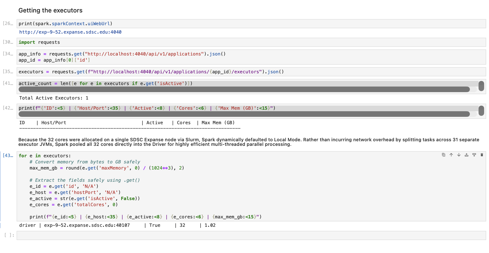
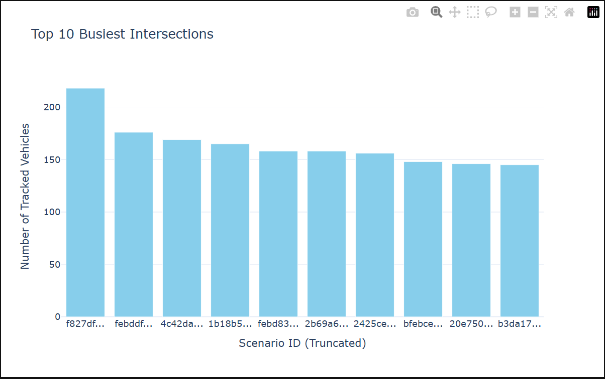

# DSC232 Waymo Group Project

Kristen Oleson 
Cory Ornelas 
Audrius Pasvenskas 
Mandy Xu 

## SDSC Expanse Environment Setup
To process the 30 GB of raw Waymo Protobuf files, we utilized the SDSC Expanse supercomputer. We requested an interactive session with the following hardware allocation:

Total Cores: 32

Total Memory: 150 GB

SparkSession Configuration & Justification:
Because the 32 cores were allocated on a single SDSC Expanse node via Slurm, Spark dynamically defaulted to Local Mode. Rather than incurring network overhead by splitting tasks across separate executor JVMs, Spark pooled all 32 cores directly into the Driver for highly efficient multi-threaded parallel processing.

Executor Instances: 31 (Calculated as Total Cores [32] - 1 Driver = 31).

Driver Memory: 2 GB.

Executor Memory: 4 GB (Calculated as [150 GB - 2 GB] / 31 = 4.77 GB. We conservatively allocated 4 GB per executor to leave room for OS overhead).

Spark UI Executor Allocation Screenshot: 

## Dataset Overview

Dataset: [Waymo Open Motion Dataset](https://waymo.com/open/data/motion/) 
Number of observations: 832,346

Each observation corresponds to a single tracked vehicle trajectory extracted from raw scenario protobuf files after filtering and preprocessing.

## Data

#### **scenario_id (string, categorical)** 
A unique identifier for a driving scenario (scene). Each scenario contains multiple agents (vehicles) and represents a short driving clip. 
Scale: Nominal -- identifier, no numerical meaning 
Distribution: After aggregating by scenario_id, the scenario-level statistics are shown below.

* Number of scenarios: 29,411 
* Mean: 28.30 vehicles per scenario 
* Std dev: 19.83 
* Min: 1 
* Max: 218 
* Quantiles: [1, 14, 24, 37, 218] 

This shows a moderately right-skewed distribution where most scenarios contain a few dozen vehicles, but some dense traffic scenes contain significantly more.

#### **track_id (long, categorical)** 
A unique identifier for a specific vehicle within a scenario. 
Scale: Nominal -- identifier 
Distribution: Similar to scenario_id, statistics after aggregating by track_id are shown below.

* Count: 6,855 
* Mean: 121.42 
* Std dev: 220.61 
* Min: 1 
* Max: 3,246 
* Quantiles: [1, 6, 45, 191, 3246]

The distribution is highly right-skewed with a long tail. A small subset of track_ids account for a disproportionately large number of observations (up to 3,246), reflecting identifier reuse across independent scenarios rather than repeated tracking of the same physical object.

#### **past_x (array<double>, continuous), past_y (array<double>, continuous)** 
Sequences of x and y coordinates representing the observed past motion of a vehicle.

past_x[i], past_y[i] = position of the vehicle at timestep i in the past 
History length: 11 timesteps (~1 second of motion at 10 Hz) 
Scale: Continuous, ratio -- real-valued coordinates in meters in a local coordinate frame 
Distribution: The coordinate distributions were computed by flattening trajectory timesteps, resulting in over 9 million spatial points. 

* Count: 9,155,806 
* Mean X/Y: 1707.59 / 476.31 
* Std X/Y: 5201.91 / 6328.72 
* Min X/Y: -35046.16 / -37133.23 
* Max X/Y: 36063.83 / 237063.28 
* X quantiles: [-35046.1640625, -712.203125, 1195.2431640625, 4899.6650390625, 36063.83203125] 
* Y quantiles: [-37133.23046875, -2616.59228515625, 492.1311950683594, 3147.22216796875, 237063.28125]

The distribution is highly dispersed with large variance due to aggregation across many scenarios with different local coordinate origins. Median values are closer to zero than the mean, indicating skewness and the presence of extreme spatial outliers. Most motion is concentrated within a few thousand meters, but rare extreme values produce long tails.

#### **future_x (array<double>, continuous), future_y (array<double>, continuous)** 
This is the target variable. Sequences of x and y coordinates representing the ground-truth future motion of the vehicle.

future_x[i], future_y[i] = position of the vehicle at timestep i in the future 
Prediction horizon: 80 timesteps (~8 seconds at 10 Hz) 
Scale: Continuous, ratio -- meters in the same coordinate frame as past trajectories 
Distribution: Similar methodology to past data.

* Count: 66,587,680 
* Mean X/Y: 1292.10 / 370.74 
* Std X/Y: 4634.97 / 5540.49 
* Min X/Y: -35046.16 / -37130.30 
* Max X/Y: 36063.83 / 237072.20 
* X quantiles: [-35046.16, 0.00, 193.68, 3117.01, 36063.83] 
* Y quantiles: [-37130.30, -1706.96, 0.00, 1730.32, 237072.20]

The future distribution is slightly more concentrated near zero compared to the past, reflecting that many trajectories remain within local regions over short prediction horizons. However, it still exhibits heavy tails and high variance due to aggregation across diverse driving scenarios.

## Data Visualizations

To better understand the scale and spatial dynamics of the Waymo dataset, we aggregated the trajectory data using PySpark and generated the following visualizations.

#### 1. Top 10 Busiest Intersections

**Description & Insights:**
This bar chart displays the specific `scenario_id` values that contain the highest volume of tracked agents. As shown, the busiest intersection contains over 210 simultaneously tracked vehicles. By isolating these high-density scenes, we can assess the computational load and interaction complexity our forecasting model will need to handle compared to quieter environments. 

#### 2. Intersection Density

**Description & Insights:**
This histogram plots the frequency distribution of vehicle counts per 9.1-second scenario. The data exhibits a strong right-skewed distribution. While the vast majority of the 29,411 scenarios contain fewer than 50 vehicles, there is a long tail of highly congested scenes extending past 200 vehicles. Understanding this density distribution is crucial for our preprocessing plan, ensuring we account for data imbalance between sparse and highly congested traffic patterns.

#### 3. Detailed Vehicle Trajectory

**Description & Insights:**
This spatial scatter plot maps the local $X$ and $Y$ coordinates (in meters) of a single tracked vehicle over a full 9.1-second window. 
* **Green Star:** The vehicle's initial starting position.
* **Blue Line (Past):** The 1.1-second historical trajectory used as the input features ($X$).
* **Red Line (Future):** The 8.0-second future trajectory used as the ground-truth target labels ($y$).

This visualization perfectly illustrates the Sequence-to-Sequence nature of our modeling task, showing the exact spatial progression the algorithm must learn to predict based on the initial motion vectors.

## Missing and Duplicate Values

Missing values: None (invalid or incomplete trajectories are filtered out during preprocessing) 
Duplicate values: None detected in the final dataset

## Preprocessing Plan

To prepare the Waymo Open Motion Dataset for analysis, we’ll apply several preprocessing steps to ensure data quality and consistency. For missing values, we will first assess their presence across trajectory features such as position and velocity. If missing values are minimal, we’ll remove those records using Spark’s dropna() function. If needed, we’ll apply imputation strategies such as forward-filling or replacing with mean values where appropriate.

To address potential data imbalance, specifically if certain driving behaviors (e.g., straight driving vs. turning at intersections) are overrepresented, we’ll evaluate the distribution of target behaviors. If imbalance is present, we may apply sampling techniques such as undersampling dominant classes or oversampling underrepresented scenarios to improve model performance.

We will also apply transformations to prepare the data for analysis. Continuous variables such as position and velocity will be scaled or normalized to ensure consistency across features. Categorical variables, such as object type, will be transformed into numerical indicator variables (binary columns) to support analysis. Additionally, we could perform feature engineering to create new variables such as speed, acceleration, and relative distances between agents to better capture interaction dynamics.

All preprocessing will be performed using Spark DataFrame operations to support distributed processing. This includes functions such as dropna() and fillna() for handling missing data, filter() for selecting relevant scenarios (e.g., intersections), withColumn() for creating new features, and groupBy() and agg() for aggregations. These operations allow efficient handling of large-scale data while maintaining scalability across distributed computing resources.

