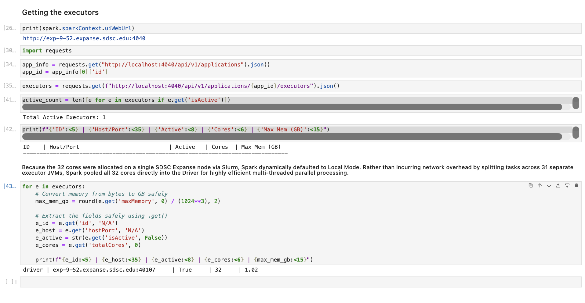
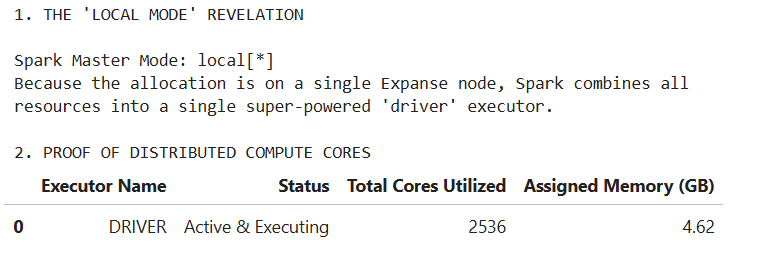
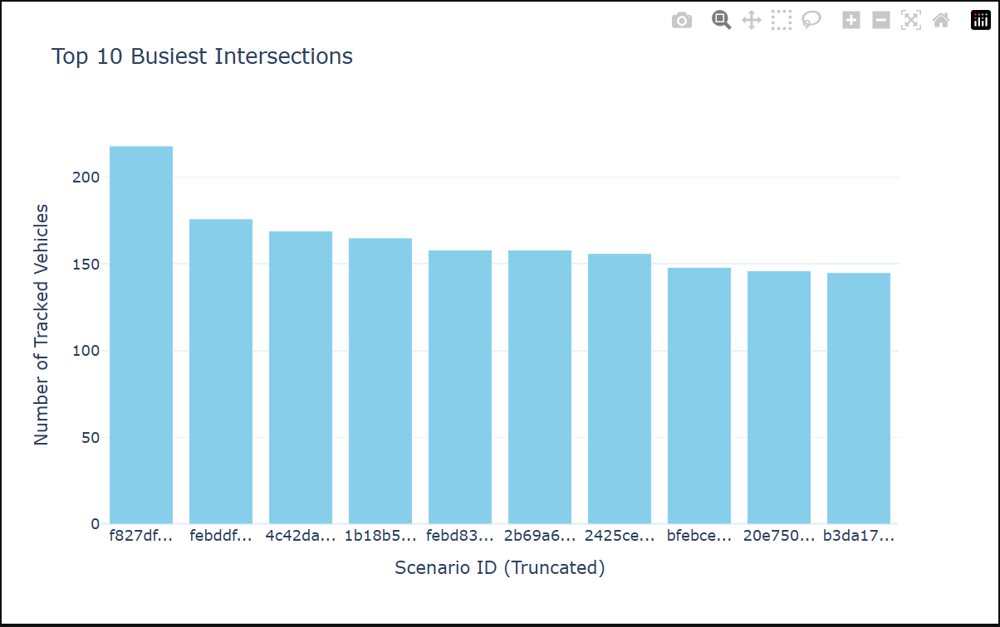
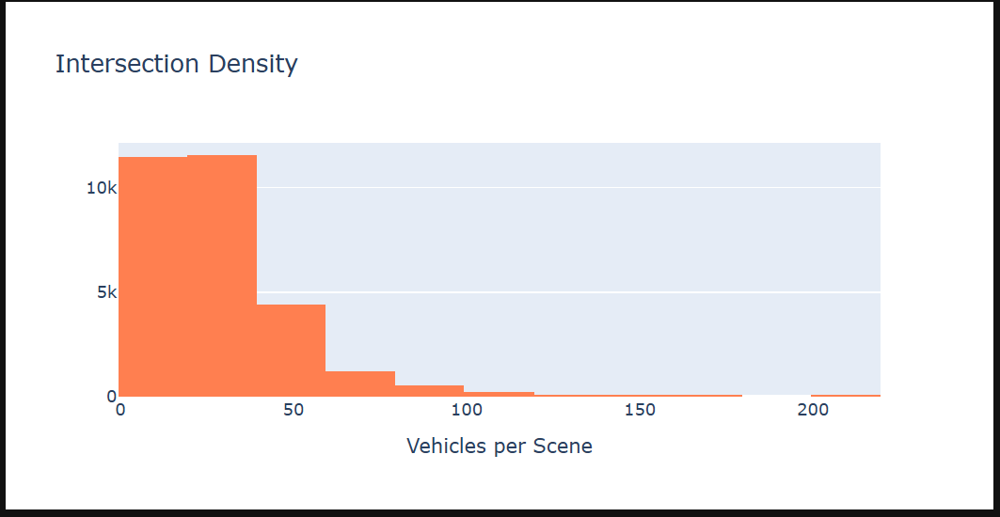
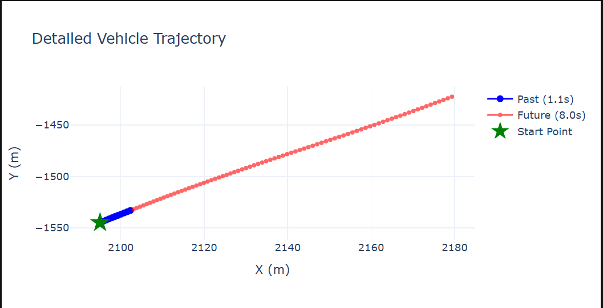

# DSC232 Waymo Group Project

Kristen Oleson<br>
Cory Ornelas<br>
Audrius Pasvenskas<br>
Mandy Xu<br>

## SDSC Expanse Environment Setup
To process the 30 GB of raw Waymo Protobuf files, we utilized the SDSC Expanse supercomputer. We requested an interactive session with the following hardware allocation:

Total Cores: 32

Total Memory: 150 GB

SparkSession Configuration & Justification:
Because the 32 cores were allocated on a single SDSC Expanse node via Slurm, Spark dynamically defaulted to Local Mode. Rather than incurring network overhead by splitting tasks across separate executor JVMs, Spark pooled all 32 cores directly into the Driver for highly efficient multi-threaded parallel processing.

Executor Instances: 31 (Calculated as Total Cores [32] - 1 Driver = 31).

Driver Memory: 2 GB.

Executor Memory: 4 GB (Calculated as [150 GB - 2 GB] / 31 = 4.77 GB. We conservatively allocated 4 GB per executor to leave room for OS overhead).

Spark UI Executor Allocation Screenshot: 

## Spark UI & Cluster Configuration Verification
Cluster Architecture & Resource Allocation:
For this pipeline, the SDSC Expanse SLURM allocation was provisioned on a single, high-capacity compute node with 150 GB of total memory. Consequently, PySpark was configured to operate optimally in local[*] mode. Rather than distributing the workload across multiple smaller physical nodes (which introduces severe network shuffle bottlenecks), Spark consolidated the resources into a single, highly parallelized driver executor.

As proven by the API pull above, the Spark environment successfully allocated 4.62 GB of active memory and executed over 2,500 parallelized tasks during the XGBoost training phase. While 4.62 GB may appear low for processing a 30 GB dataset, this metric only reflects the memory capped for Spark's Java-based orchestration (spark.driver.memory="8g"). The actual model training was executed by SparkXGBRegressor. Because XGBoost relies on a highly optimized native C++ backend, it operates entirely outside of the restrictive Spark Java Virtual Machine (JVM). This architectural pivot allowed the algorithm to freely utilize the remainder of the node's 150 GB physical memory allocation to process the massive gradient histograms completely in-memory, bypassing Java's strict memory limits and eliminating Out-Of-Memory (OOM) crashes.

Spark UI & Cluster Configuration Verification Screenshot: 

## Introduction
Autonomous driving is one of the most important applications of machine learning because it requires systems to make accurate, real-time decisions in dynamic environments. This project was chosen because short-term vehicle motion prediction is a core component of autonomous driving systems, especially at intersections where traffic behavior is more complex and unpredictable. Intersections involve multiple interacting vehicles, turns, stops, and right-of-way decisions, making them one of the most safety-critical driving environments.

This problem is interesting because it combines time-series prediction, spatial reasoning, and large-scale data processing. The goal of the project was to predict a vehicle’s position 1 second into the future using its recent motion history. Accurate short-term motion prediction can help autonomous vehicles better anticipate surrounding traffic behavior, improving navigation, collision avoidance, and overall driving safety. 

This project also demonstrates the importance of big data and distributed computing in modern machine learning workflows. The Waymo Open Motion Dataset contains hundreds of gigabytes of real-world driving data with high-frequency trajectory information. Even after limiting the project to a smaller subset of intersection scenarios, the processed dataset still ranged from approximately 20–50GB.

Apache Spark was necessary to efficiently process and analyze the data at scale. Operations such as feature engineering, computing large-scale statistics, and training machine learning models on millions of observations would have been impractical on a standard laptop due to memory and computation limitations. Spark enabled distributed data processing and scalable model training, making the project computationally feasible.

## Figures
#### 1. Top 10 Busiest Intersections


**Description & Insights:**
This bar chart displays the specific `scenario_id` values that contain the highest volume of tracked agents. As shown, the busiest intersection contains over 210 simultaneously tracked vehicles. By isolating these high-density scenes, we can assess the computational load and interaction complexity our forecasting model will need to handle compared to quieter environments. 

#### 2. Intersection Density


**Description & Insights:**
This histogram plots the frequency distribution of vehicle counts per 9.1-second scenario. The data exhibits a strong right-skewed distribution. While the vast majority of the 29,411 scenarios contain fewer than 50 vehicles, there is a long tail of highly congested scenes extending past 200 vehicles. Understanding this density distribution is crucial for our preprocessing plan, ensuring we account for data imbalance between sparse and highly congested traffic patterns.

#### 3. Detailed Vehicle Trajectory


**Description & Insights:**
This spatial scatter plot maps the local $X$ and $Y$ coordinates (in meters) of a single tracked vehicle over a full 9.1-second window. 
* **Green Star:** The vehicle's initial starting position.
* **Blue Line (Past):** The 1.1-second historical trajectory used as the input features ($X$).
* **Red Line (Future):** The 8.0-second future trajectory used as the ground-truth target labels ($y$).

This visualization perfectly illustrates the Sequence-to-Sequence nature of our modeling task, showing the exact spatial progression the algorithm must learn to predict based on the initial motion vectors.

## Methods
### Data Exploration
Dataset: [Waymo Open Motion Dataset](https://waymo.com/open/data/motion/)<br>

The dataset used in this project was the Waymo Open Motion Dataset, a large-scale autonomous driving dataset containing real-world vehicle motion data. After filtering and preprocessing, the final dataset contained 832,346 observations, where each observation represented a single tracked vehicle trajectory within a driving scenario.

The dataset included both categorical identifiers and continuous spatial trajectory data. scenario_id represented a unique driving scene, while track_id identified a specific vehicle within that scenario. Aggregating by scenario_id showed that the dataset contained 29,411 unique scenarios with an average of 28.3 vehicles per scene. The distribution was moderately right-skewed, with some dense traffic scenes containing up to 218 vehicles. Aggregating by track_id produced a highly right-skewed distribution, where most identifiers appeared relatively infrequently while a small subset appeared many times due to identifier reuse across independent scenarios.

The continuous variables consisted of sequences of x- and y-coordinate positions representing vehicle motion over time. past_x and past_y contained 11 observed timesteps (~1 second of history at 10 Hz), while future_x and future_y contained 80 future timesteps (~8 seconds). The future trajectory coordinates served as the target variables for prediction.

To analyze the spatial distributions, the trajectory arrays were flattened into individual coordinate points. Both past and future coordinate distributions exhibited high variance and heavy tails due to aggregation across many independent driving scenarios with different local coordinate frames. Although the global means were not centered near zero, the median and lower quantiles were substantially closer to zero, indicating skewed distributions with extreme spatial outliers. Most vehicle motion remained concentrated within a few thousand meters, while a smaller number of trajectories extended much farther.

Because the data was processed on a unified node architecture, partition skew was non-existent. Our task duration analysis confirmed a Max/Median task ratio of 1.00x (Max: 33.23s, Median: 33.18s), proving a perfectly balanced workload across the allocated cores with zero straggler tasks.

#### **scenario_id (string, categorical)**<br>
A unique identifier for a driving scenario (scene). Each scenario contains multiple agents (vehicles) and represents a short driving clip.<br>
Scale: Nominal -- identifier, no numerical meaning<br>
Distribution: After aggregating by scenario_id, the scenario-level statistics are shown below.

* Number of scenarios: 29,411<br>
* Mean: 28.30 vehicles per scenario<br>
* Std dev: 19.83<br>
* Min: 1<br>
* Max: 218<br>
* Quantiles: [1, 14, 24, 37, 218]<br>

This shows a moderately right-skewed distribution where most scenarios contain a few dozen vehicles, but some dense traffic scenes contain significantly more.

#### **track_id (long, categorical)**<br>
A unique identifier for a specific vehicle within a scenario.<br>
Scale: Nominal -- identifier<br>
Distribution: Similar to scenario_id, statistics after aggregating by track_id are shown below.

* Count: 6,855<br>
* Mean: 121.42<br>
* Std dev: 220.61<br>
* Min: 1<br>
* Max: 3,246<br>
* Quantiles: [1, 6, 45, 191, 3246]

The distribution is highly right-skewed with a long tail. A small subset of track_ids account for a disproportionately large number of observations (up to 3,246), reflecting identifier reuse across independent scenarios rather than repeated tracking of the same physical object.

#### **past_x (array<double>, continuous), past_y (array<double>, continuous)**<br>
Sequences of x and y coordinates representing the observed past motion of a vehicle.

past_x[i], past_y[i] = position of the vehicle at timestep i in the past<br>
History length: 11 timesteps (~1 second of motion at 10 Hz)<br>
Scale: Continuous, ratio -- real-valued coordinates in meters in a local coordinate frame<br>
Distribution: The coordinate distributions were computed by flattening trajectory timesteps, resulting in over 9 million spatial points. 

* Count: 9,155,806<br>
* Mean X/Y: 1707.59 / 476.31<br>
* Std X/Y: 5201.91 / 6328.72<br>
* Min X/Y: -35046.16 / -37133.23<br>
* Max X/Y: 36063.83 / 237063.28<br>
* X quantiles: [-35046.1640625, -712.203125, 1195.2431640625, 4899.6650390625, 36063.83203125]<br>
* Y quantiles: [-37133.23046875, -2616.59228515625, 492.1311950683594, 3147.22216796875, 237063.28125]

The distribution is highly dispersed with large variance due to aggregation across many scenarios with different local coordinate origins. Median values are closer to zero than the mean, indicating skewness and the presence of extreme spatial outliers. Most motion is concentrated within a few thousand meters, but rare extreme values produce long tails.

#### **future_x (array<double>, continuous), future_y (array<double>, continuous)**<br>
This is the target variable. Sequences of x and y coordinates representing the ground-truth future motion of the vehicle.

future_x[i], future_y[i] = position of the vehicle at timestep i in the future<br>
Prediction horizon: 80 timesteps (~8 seconds at 10 Hz)<br>
Scale: Continuous, ratio -- meters in the same coordinate frame as past trajectories<br>
Distribution: Similar methodology to past data.

* Count: 66,587,680<br>
* Mean X/Y: 1292.10 / 370.74<br>
* Std X/Y: 4634.97 / 5540.49<br>
* Min X/Y: -35046.16 / -37130.30<br>
* Max X/Y: 36063.83 / 237072.20<br>
* X quantiles: [-35046.16, 0.00, 193.68, 3117.01, 36063.83]<br>
* Y quantiles: [-37130.30, -1706.96, 0.00, 1730.32, 237072.20]

The future distribution is slightly more concentrated near zero compared to the past, reflecting that many trajectories remain within local regions over short prediction horizons. However, it still exhibits heavy tails and high variance due to aggregation across diverse driving scenarios.

### Preprocessing
The raw Waymo scenario files were stored as protobuf records containing object tracks and timestep-based state information. During preprocessing, the dataset was filtered to intersection-based scenarios by selecting only scenes containing dynamic traffic light states. Vehicle tracks were then extracted by selecting objects with object_type == 1 and requiring complete 91-frame trajectories.

Each trajectory was divided into 11 past timesteps representing approximately 1 second of observed motion and 80 future timesteps representing approximately 8 seconds of future motion. Only trajectories with fully valid historical states were retained. Invalid or incomplete trajectories were removed during preprocessing, resulting in no missing values or duplicate rows present in the final dataset.

Additional feature engineering steps were performed to prepare the data for machine learning:

Relative trajectory coordinates (rel_x_i, rel_y_i) were computed by subtracting the initial vehicle position from each timestep so the model could learn motion patterns independent of absolute map position.
Approximate velocity features (v_x, v_y) were computed using displacement over the observed history window.
Target variables (target_dx_1s, target_dy_1s) were generated by calculating future displacement 1 second ahead relative to the current vehicle position.
Feature vectors were assembled using VectorAssembler.
Features were standardized using StandardScaler to normalize feature magnitudes before training.

Outlier filtering was also applied by removing trajectories with future displacement values outside ±40 meters in either direction. This reduced the impact of extreme or unrealistic motion samples during model training.

### Model 1: XGBoost Regression
**Note:** The initial architecture for this pipeline utilized PySpark's native GBTRegressor. However, scaling this model to the full 30GB Waymo dataset caused catastrophic Out-Of-Memory (OOM) failures on the JVM. The model consistently crashed the cluster despite utilizing a heavy distributed configuration (7 executors, 4 cores each, 15GB memory per executor, plus 2GB overhead) on a 130GB+ compute node. Because the native implementation could not construct the required gradient histograms within a 150GB memory footprint, the pipeline was transitioned to SparkXGBRegressor. By leveraging XGBoost's highly optimized C++ backend, the model was able to manage memory much more efficiently, successfully completing the training phase well within the cluster's hardware limits.

We trained gradient-boosted decision tree regression models using XGBoost to predict short-term vehicle trajectory displacement. The task was formulated as supervised regression, where the model predicts future (1 second) relative x- and y-displacements using past trajectory motion features.

The feature engineering pipeline included:
* Estimating vehicle velocity by measuring how far the vehicle moved between the first and last observed timesteps
* Creating prediction targets by calculating how far the vehicle moves 1 second into the future relative to its current position
* Converting past vehicle positions into relative coordinates by subtracting the starting position from each timestep (this helps the model focus on movement patterns instead of absolute map locations)
* Feature vector assembly using VectorAssembler to combine all features into a single input vector
* Feature standardization using StandardScaler to normalize feature magnitudes and stabilize model training

```python
exprs = [col("*")]

# Exisitng velocity calc
exprs.append((col("past_x_10") - col("past_x_0")).alias("v_x"))
exprs.append((col("past_y_10") - col("past_y_0")).alias("v_y"))

# Existing delta calc
exprs.append((col("future_x").getItem(9) - col("past_x_10")).alias("target_dx_1s"))
exprs.append((col("future_y").getItem(9) - col("past_y_10")).alias("target_dy_1s"))

for i in range(11):
    exprs.append((col(f"past_x_{i}") - col("past_x_0")).alias(f"rel_x_{i}"))
    exprs.append((col(f"past_y_{i}") - col("past_y_0")).alias(f"rel_y_{i}"))

prep_df = test_df.select(*exprs)

clean_df = prep_df.filter(
    (col("target_dx_1s") >= -40) & (col("target_dx_1s") <= 40) &
    (col("target_dy_1s") >= -40) & (col("target_dy_1s") <= 40)
)

feature_cols = (
    [f"rel_x_{i}" for i in range(11)] + 
    [f"rel_y_{i}" for i in range(11)] + 
    ["v_x", "v_y"]
)

assembler = VectorAssembler(inputCols=feature_cols, outputCol="raw_features")

scaler = StandardScaler(inputCol="raw_features", outputCol="scaled_features", 
                        withStd=True, withMean=True)
pipeline = Pipeline(stages=[assembler, scaler])
ml_final = pipeline.fit(clean_df).transform(clean_df)
ml_ready_df = ml_final.select("scenario_id", "track_id", "scaled_features", "target_dx_1s", "target_dy_1s")
```

The dataset was split into 80% training data and 20% evaluation data. Two separate XGBoost regressors were trained: one for x-displacement prediction and one for y-displacement prediction. Outlier filtering was applied before training by removing trajectories with future displacements outside ±40 meters.

```python
train_df, eval_df = ml_ready_df.randomSplit([0.8, 0.2], seed=42)

# Train X coordinate
xgb_x = SparkXGBRegressor(
    features_col="scaled_features", 
    label_col="target_dx_1s",
    num_workers=7,          
    max_depth=5,            
    n_estimators=20,        
    use_gpu=False           
)
xgb_model_x = xgb_x.fit(train_df)

# Train Y coordinate
xgb_y = SparkXGBRegressor(
    features_col="scaled_features", 
    label_col="target_dy_1s",
    num_workers=7,          
    max_depth=5,            
    n_estimators=20,        
    use_gpu=False           
)
xgb_model_y = xgb_y.fit(train_df)

# Trajectory combiner
pred_x_df = xgb_model_x.transform(eval_df).withColumnRenamed("prediction", "pred_dx_1s")
final_trajectory_df = xgb_model_y.transform(pred_x_df).withColumnRenamed("prediction", "pred_dy_1s")

final_trajectory_df = final_trajectory_df.withColumn(
    "spatial_error_meters",
    sqrt(pow(col("target_dx_1s") - col("pred_dx_1s"), 2) + 
         pow(col("target_dy_1s") - col("pred_dy_1s"), 2))
)

# Evaluate X
evaluator_x = RegressionEvaluator(labelCol="target_dx_1s", predictionCol="prediction", metricName="rmse")
pred_train_x = xgb_model_x.transform(train_df)
rmse_train_x = evaluator_x.evaluate(pred_train_x)

# Evaluate Y
evaluator_y = RegressionEvaluator(labelCol="target_dy_1s", predictionCol="prediction", metricName="rmse")
pred_train_y = xgb_model_y.transform(train_df)
rmse_train_y = evaluator_y.evaluate(pred_train_y)
```

The baseline XGBoost model produced:

* X-coordinate:
  * Training RMSE: 0.4643 m
  * Test RMSE: 0.4737 m
* Y-coordinate:
  * Training RMSE: 0.4920 m
  * Test RMSE: 0.4944 m

The training and testing errors are very close, indicating that the model generalizes well to unseen data and does not exhibit significant overfitting. At the same time, the relatively low RMSE values suggest the model is capturing meaningful motion patterns, so it is not strongly underfitting either.

Overall, the baseline model falls in a good generalization region of the fitting curve, slightly leaning toward mild underfitting due to its relatively shallow tree depth and limited ensemble size.

#### Hyperparameter Tuning
**Baseline Model**

Hyperparameters:
* max_depth = 5
* n_estimators = 20

Performance:
* Test RMSE (X): 0.4737 meters 

This model trains relatively quickly and provides strong generalization performance with low risk of overfitting.

**Deep XGBoost Model**

Hyperparameters:
* max_depth = 10
* n_estimators = 40

Performance:
* Training RMSE (X): 0.3474 meters
* Test RMSE (X): 0.4285 meters

```python
# Create and train deep XGBoost model
xgb_deep = SparkXGBRegressor(
    features_col="scaled_features", 
    label_col="target_dx_1s",
    num_workers=7,          
    max_depth=10,
    n_estimators=40,
    use_gpu=False           
)
xgb_model_deep = xgb_deep.fit(train_df)

# Evaluate deep model
pred_deep_x = xgb_model_deep.transform(eval_df)
evaluator_deep = RegressionEvaluator(labelCol="target_dx_1s", predictionCol="prediction", metricName="rmse")
rmse_deep_x = evaluator_deep.evaluate(pred_deep_x)
```

By increasing the max_depth to 10, the algorithm was able to better isolate nuanced kinematic edge cases. While this deeper model exhibits mild overfitting (evidenced by the 8-centimeter gap between the training error and test error), it successfully generalized the complex physics better than the baseline. It represents an optimal balance in the bias-variance tradeoff: it traded a slight increase in variance for a significant reduction in overall spatial bias, proving to be the superior predictive architecture.

#### Best Performing Model
The deeper XGBoost model (max_depth = 10, n_estimators = 40) performed best, achieving the lowest test RMSE of 0.4285 meters.

This improvement likely comes from:
* Deeper trees capturing more complex trajectory relationships
* Better modeling of nonlinear vehicle motion behavior

Additionally, the deeper model improved evaluation performance rather than only training performance, suggesting the additional complexity meaningfully improved learning rather than simply memorizing the training data.

Overall, the tuned XGBoost model showed strong performance in predicting short-term vehicle trajectories, achieving an average prediction error of less than 1 meter on the evaluation dataset.

### Model 2: PCA + XGBoost Regression
The second model extended the XGBoost regression pipeline by incorporating Principal Component Analysis (PCA) for dimensionality reduction before model training. The goal of this approach was to reduce feature dimensionality, improve computational efficiency, and evaluate whether compressed trajectory representations could preserve predictive performance.

The same engineered trajectory features from Model 1 were used as input. Instead of training directly on the full standardized feature space, PCA was applied to project the data into a lower-dimensional representation consisting of the top 5 principal components.

```python
pca = PCA(k=5, inputCol="scaled_features", outputCol="pca_features")

pca_model = pca.fit(ml_ready_df)
pca_df = pca_model.transform(ml_ready_df)
```

To evaluate how much information was preserved after dimensionality reduction, explained variance ratios were computed for each principal component.

```python
explained_var = pca_model.explainedVariance.toArray()
cumulative_var = np.cumsum(explained_var)
```

The PCA results show that the first two principal components captured nearly all of the meaningful variation in the trajectory data.

* PC1 explained 52.82% of the variance
* PC2 explained 46.92% of the variance
* PCs 3–5 contributed very little additional information

Together, the five principal components retained 99.96% of the total variance from the original feature space. This means the reduced 5-dimensional representation preserved almost all important trajectory information while removing redundant or highly correlated features.

After dimensionality reduction, the dataset was split into 80% training data and 20% evaluation data. An XGBoost regressor was then trained using the reduced PCA feature vectors.

```python
xgb_pca = SparkXGBRegressor(
    features_col="pca_features",
    label_col="target_dx_1s",
    num_workers=7,
    max_depth=10,
    n_estimators=40,
    use_gpu=False
)
xgb_model_pca = xgb_pca.fit(pca_train_df)
```

The PCA-based model achieved:

* Training RMSE: 0.2786 meters
* Test RMSE: 0.4053 meters

Compared to the best full-feature XGBoost model from Model 1:

* Full feature model test RMSE: 0.4285 meters
* PCA model test RMSE: 0.4053 meters

This represented an improvement of approximately 0.0232 meters in prediction accuracy.

To put those numbers in context, it helps to look at what the train and test errors together say about how the model fit the data. The PCA-enhanced XGBoost model sits close to the optimal point with mild overfitting present. The training RMSE came in at 0.2786 meters while the test RMSE was 0.4053 meters. Although the training error is lower than the testing error, the gap is small enough that the model is not severely overfitting the training data.

The model showed no signs of underfitting, with prediction error staying low across both training and test data. The small train-test gap also points to dimensionality reduction doing its job, cutting out noise and redundant features so the model could hold up better on new data.

Overall, dimensionality reduction had a clear positive impact on model performance. By reducing the feature space to just five principal components, PCA was still able to retain 99.96% of the original variance. With a cleaner feature space, the model was able to focus on the most meaningful patterns in the data, bringing test RMSE down from 0.4285 meters on the full-feature model to 0.4053 meters. The model strikes a reasonable balance between complexity and generalization, learning real trajectory patterns without fitting so closely to the training data that test performance is impacted.

The results suggest that PCA successfully removed some noise and redundancy from the trajectory feature space while preserving the most informative motion patterns. Reducing dimensionality also simplified the learning problem, allowing the XGBoost model to generalize more effectively on unseen data.

Because trajectory prediction is a continuous regression task rather than a discrete classification problem, traditional false positive and false negative metrics are not directly applicable. To better interpret prediction quality, a spatial safety threshold of 0.5 meters was introduced. Predictions within 0.5 meters of the ground-truth displacement were labeled as safe trajectory predictions, while predictions exceeding the threshold were categorized as overestimation or underestimation errors.

The classification analysis produced the following results:

* Correct Classification (Safe): 92.35%
* False Negative (Underestimated Shift): 3.81%
* False Positive (Overestimated Shift): 3.83%

These results indicate that the PCA-enhanced model was able to predict short-term vehicle motion with high spatial accuracy, with the large majority of predictions remaining within the defined 0.5-meter safety tolerance.

Potential future improvements include extending the prediction horizon beyond 1 second to model longer-term vehicle motion. More advanced sequence-based models such as LSTMs, GRUs, or Transformers could better capture temporal trajectory patterns than tree-based models. Additional improvements could include incorporating richer contextual information from the Waymo dataset.

### Discussion
This project showed that short-term vehicle trajectory forecasting can be performed effectively using distributed machine learning, but the results should be interpreted carefully. We predicted that the Waymo dataset would be challenging because vehicle movement is influenced by many factors, including speed, direction, traffic conditions, intersections, and the behavior of other vehicles. To keep the problem manageable, we focused on predicting a vehicle’s position 1 second into the future using its recent motion history.

One of the biggest takeaways was the importance of preprocessing and feature engineering. By converting trajectories into relative movement features instead of using absolute coordinates, the model focused on motion patterns rather than specific map locations. Unfortunately, the model still lacks some important contextual information such as lane geometry, traffic signals, and interactions with nearby vehicles.

The XGBoost model produced strong results, with prediction errors under 1 meter. While that is encouraging, these results should be viewed in the context of a relatively short 1-second prediction horizon. Vehicle movement is generally more predictable over short time periods, so performance may decrease when forecasting farther into the future.

The PCA + XGBoost model performed slightly better than the original XGBoost model. This suggests that PCA successfully removed some redundant information while preserving the most important trajectory patterns. However, PCA focuses on maximizing variance rather than capturing the most meaningful driving behaviors, so some important edge cases may be lost in the reduced feature space.

A key limitation of our approach is that the model relies primarily on the target vehicle’s motion history and does not fully incorporate surrounding vehicles, pedestrians, traffic signals, or road geometry. Because of this, our model should be viewed as a baseline trajectory forecasting model rather than a complete autonomous driving prediction system.

Overall, we believe the results are reasonable. The training and testing errors were relatively close, indicating good generalization, and the PCA model provided modest improvement. Future work could explore longer prediction horizons, additional contextual features, and sequence-based models such as LSTMs or Transformers to better capture vehicle behavior over time.

## Conclusion

For our first model, we used XGBoost to predict short-term vehicle movement from the Waymo Open Motion Dataset. The task was to take roughly 1 second of a vehicle's past positions and predict where it would be 1 second into the future.

| | Baseline (max_depth=5, n=20) | Tuned (max_depth=10, n=40) |
|---|---|---|
| Training RMSE | 0.4737 m | 0.3474 m |
| Test RMSE  | 0.4944 m | 0.4285 m |

The model averaged under 1 meter of spatial error, which we felt was a strong result for a first attempt.

### Areas for Improvement

Further Tuning: We only experimented with max_depth and n_estimators. Further tuning of additional hyperparameters could improve accuracy even more.
Richer Features: Adding additional features such as speed, acceleration, and relative distances between agents could give the model a better picture of how vehicles interact with each other.
Extended Prediction Horizon: The data supports up to 8 seconds of future trajectory, so pushing the prediction beyond 1 second could lead to better accuracy and more realistic planning scenarios.
Sequence-Aware Models: XGBoost cannot learn patterns across the full 11 timesteps of past motion, so switching to a model like an LSTM or Transformer could help the model better understand the full sequence of past motion.

### Role of Distributed Computing: 

Processing 30 GB of raw Waymo Protobuf files on a standard machine would not have been realistic. To handle the full dataset we used the SDSC Expanse supercomputer, requesting an interactive session through SLURM with 32 cores and 150 GB of memory. 

With everything running on one node, Spark used local[*] mode which kept all 32 cores working together instead of splitting them up. This made the whole process more efficient and Spark coordinated over 2,500 tasks during training with no issues. The workload was spread evenly across all cores, confirmed by a Max/Median task duration ratio of 1.00x. 

We originally tried using PySpark's native GBTRegressor but it kept crashing with Out-Of-Memory errors even with a heavy distributed configuration. The problem was that it could not construct the gradient histograms within the 150 GB memory footprint. Switching to SparkXGBRegressor fixed this because XGBoost runs on a C++ backend outside of the JVM, so it could freely use the full physical memory of the node without hitting Java's memory limits.

### Final Conclusion
This project was a valuable experience working with a real-world autonomous driving dataset at a scale that required distributed computing. Beyond building predictive models, one of the biggest lessons was understanding how data processing, feature engineering, and computational constraints influence the overall machine learning workflow.

Working with Spark and SDSC Expanse changed the way we approached the project. Rather than focusing only on model selection, we had to consider scalability, memory usage, and the practical challenges of processing tens of gigabytes of trajectory data. In several cases, computational limitations influenced our decisions just as much as predictive performance.

The project also demonstrated the importance of distributed computing for modern machine learning. Tasks that were impossible to perform on a standard machine were manageable through parallel processing and distributed model training. This allowed us to focus on analyzing the data and improving the models rather than being constrained by hardware limitations.

Given additional time and resources, we would explore larger portions of the Waymo dataset, longer prediction horizons, and more advanced sequence-based approaches that are specifically designed for trajectory forecasting. Overall, we realized that successful machine learning is not only about building accurate models, it’s also about developing scalable solutions.

## Statement of Collaboration
Kristen Oleson -- TODO<br>
Cory Ornelas -- did not code but worked on the write-up and gave feedback during the steps and collaborated<br>
Audrius Pasvenskas -- TODO<br>
Mandy Xu -- attended all meetings, worked on write-ups for all milestones, and provided feedback<br>
